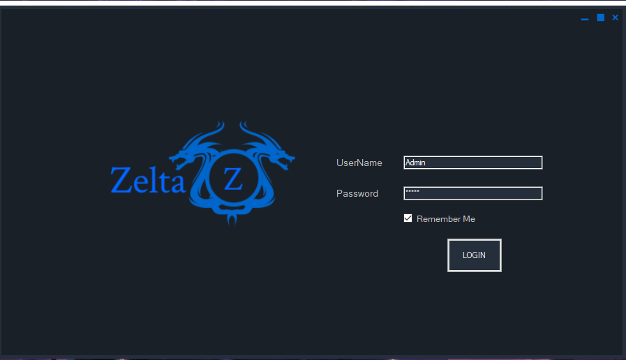
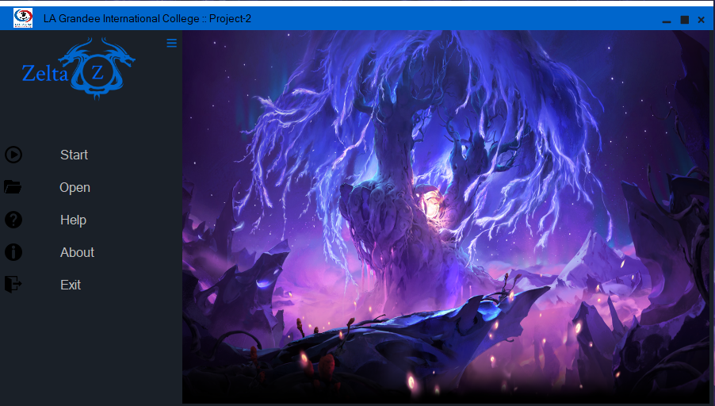
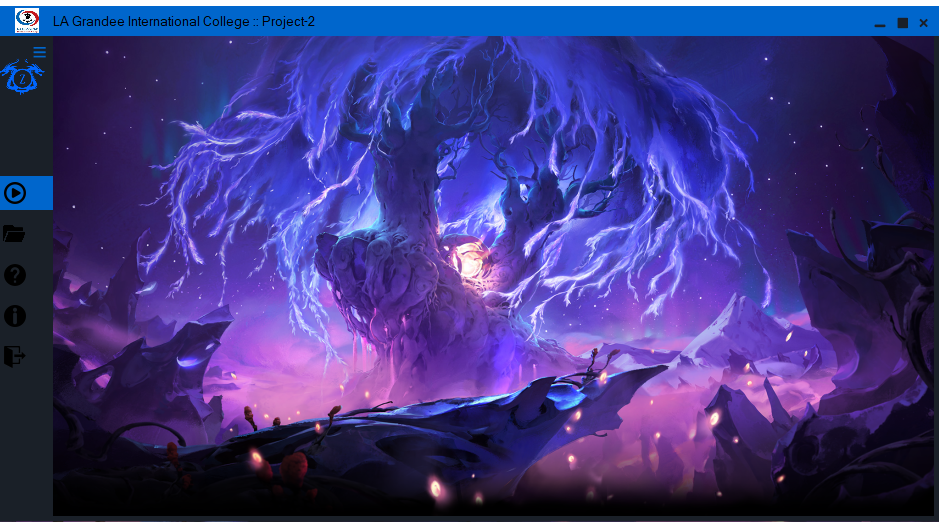
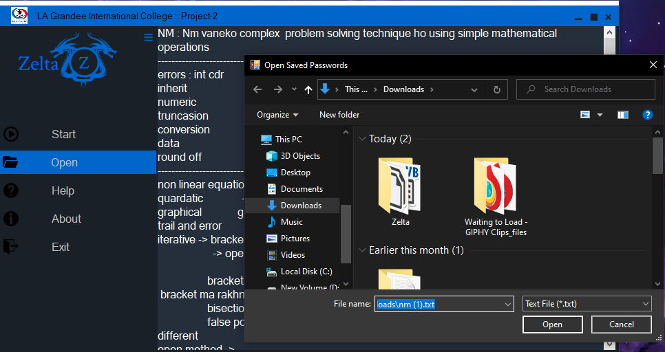
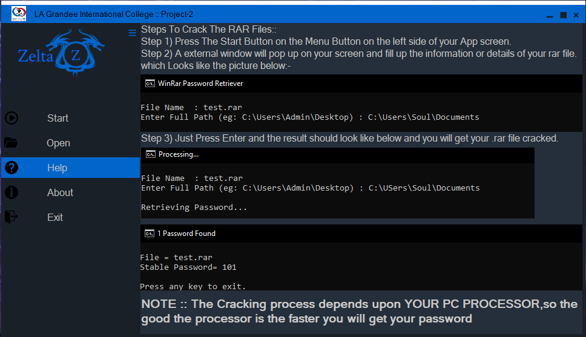
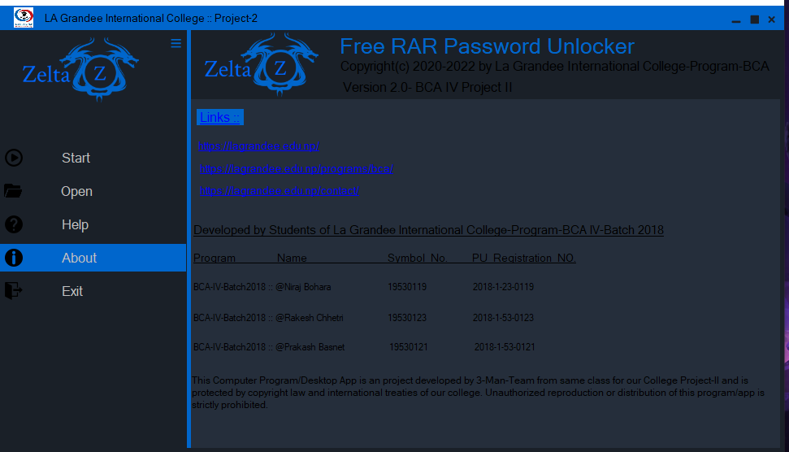
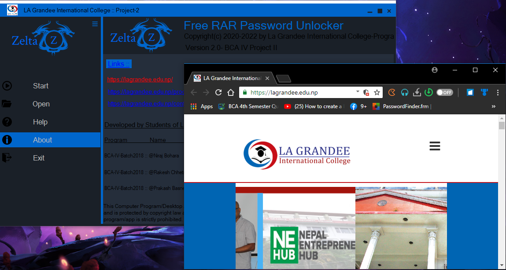
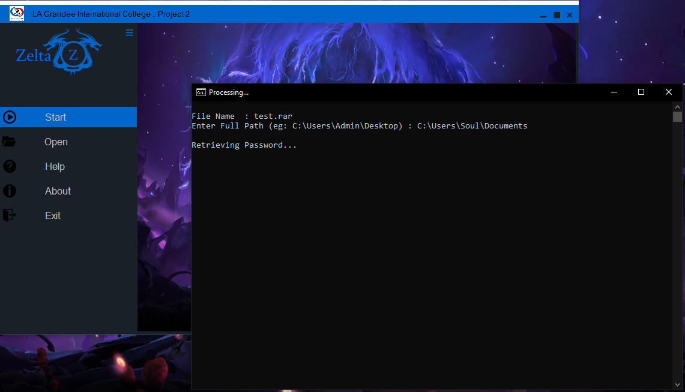
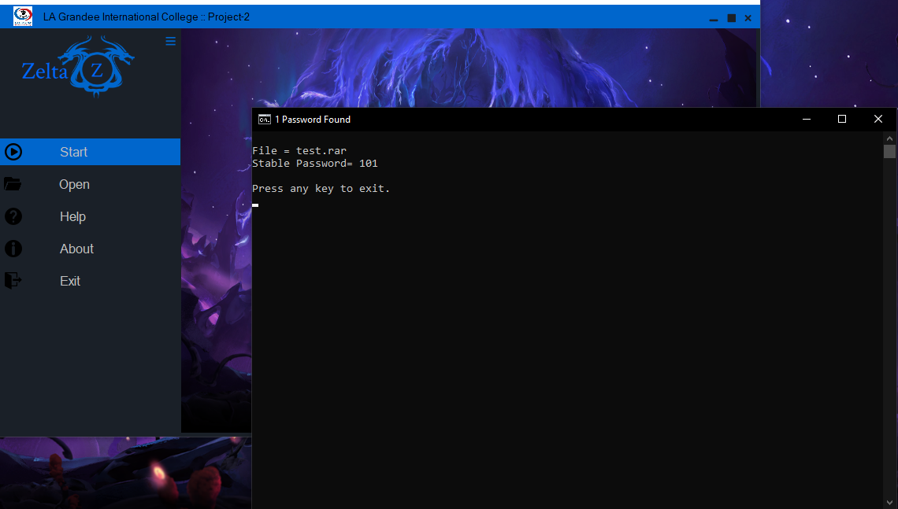

# Zelta 3 - RAR and ZIP File Cracker (2019)

<p align="center">
  Zelta 3, a project created in 2019, is a RAR and ZIP file cracker developed using Visual Studio .NET and batch scripting. This tool is designed for learning purposes only and should be used responsibly.
</p>

## Introduction

Zelta 3 is a project created for educational purposes to understand and explore file encryption mechanisms. Developed using Visual Studio .NET and batch scripting, it provides a basic framework for cracking RAR and ZIP files. Please note that this project is intended for educational use only, and any misuse is strongly discouraged.

## Features

- **RAR and ZIP Cracking:** Learn about file encryption and cracking mechanisms.
- **Visual Studio .NET:** Developed using Visual Studio for ease of understanding and modification.
- **Batch Scripting:** Utilizes batch scripting for specific functionalities.

## Getting Started

To run Zelta 3, follow these steps:

1. **Prerequisites:**
   - Install Visual Studio .NET on your system.
2. **Clone the Repository:**

   ```bash
   git clone https://github.com/soul-xettri/Zelta-3.git
   cd Zelta-3-Password-Cracker

   ```

3. \*\*Open Project in Visual Studio.net:

   - Open the project solution file (Zelta3.sln) in Visual Studio.net.

4. \*\*Build and Run:
   - Build the solution in Visual Studio.
   - Run the project to execute the cracker tool.

# Note:

    -Zelta 3 is intended for educational use only. Any misuse of this tool is strongly discouraged.

## ScreenShorts

    For a visual overview of Zelta 3, refer to the screenshots provided below:

### 1) Loading Animation
<p align="center">
  
  <br />
</p>

### 2) Login
<p align="center">
  
  <br />
</p>

### 3) Home
<p align="center">
  
  
  <br />
</p>

### 4) Upload / Open Files
<p align="center">
  
  <br />
</p>

### 5) Help
<p align="center">
  
  <br />
</p>

### 6) About
<p align="center">
  
  
  <br />
</p>

### 7) Start Cracking
<p align="center">
  
  
  <br />
</p>
